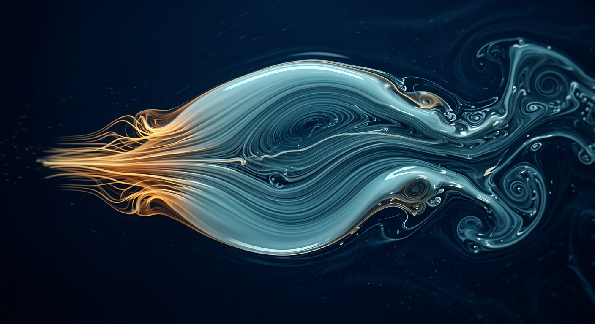
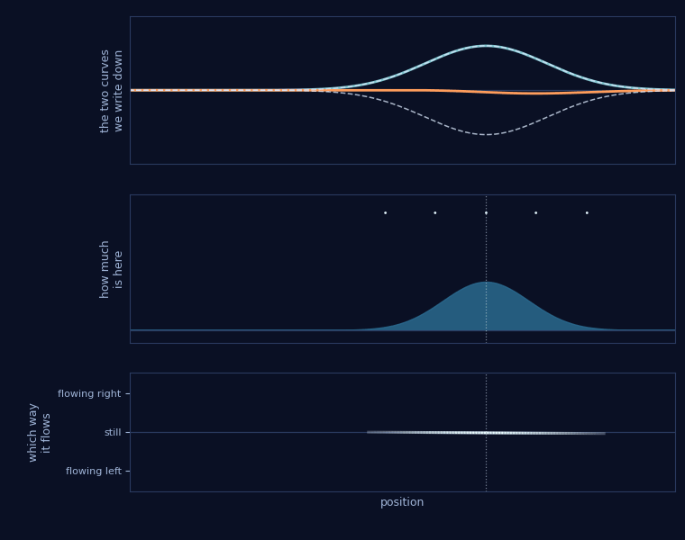
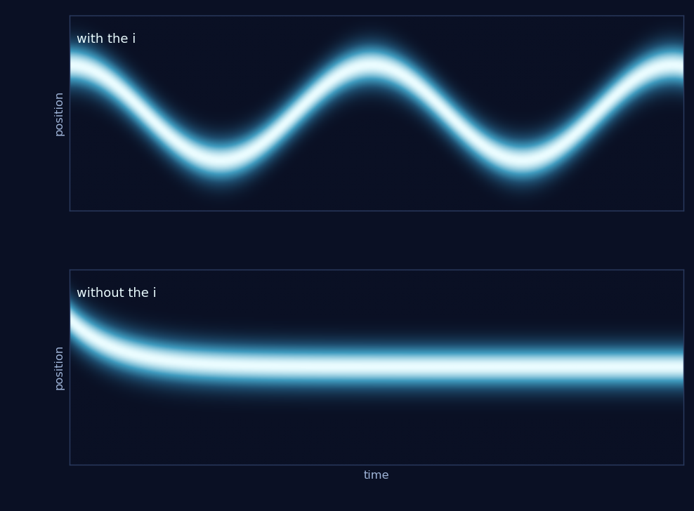

# The Fluid in the Wave Function

*Quest for Entropy #9: unzip the imaginary number and the wave function turns into a flowing liquid. I spent a long time trying to make that liquid real.*

## The question

Two episodes ago my lattice wrote down Einstein's energy formula by itself, and stopped one letter short of Schrödinger's. The missing letter was *i*, the imaginary number, and I called it a zipper.

That word is mine, not the textbook's, so let me pay for it. A zipper takes two separate rows and locks them into one seam, and pulling it open hands the two rows back unharmed. That is exactly what *i* does. It takes two perfectly ordinary real numbers and makes them act as a single object: nothing is lost in the packing, nothing is added, but once they are zipped you cannot move one without moving the other.

Which is also what the word **complex** is trying to tell us, and I think it trips almost everybody. It does not mean complicated. It comes from the Latin for *braided together* — separate strands plaited into one strand. A complex number is not a hard number. It is a zipped one.

So pull the zipper open and look inside. If the wave function is two ordinary things wearing one coat, what are they?

The answer is old, and it is known. **Erwin Madelung wrote it down in 1927**, a year after the Schrödinger equation existed. Write the wave function as an amount and an angle — how much is here, and which way the phase is pointing — and quantum mechanics splits cleanly in two.

What comes out is not "a bit like" fluid mechanics. It is fluid mechanics.

## The zip

Here is the trick, with as little mathematics as I can manage.

A complex number is an arrow on a clock face: it has a length and a direction. The two real numbers we write down are the arrow's two shadows — how far it reaches sideways, how far it reaches up. The length is the arrow itself, not either shadow.

So a complex wave is an arrow at every point in space. Its length tells you **how much stuff is here** — the density is that length squared. The way its direction turns as you walk sideways tells you **which way the stuff is going** — the flow.

Three panels, one object. All of it is a single solved wave function — a packet in a bowl, worked out the ordinary way — read three ways.

**Top** is how it is usually written: two real curves, endlessly turning into each other. The dashed outline around them is the length of the arrow at each point — square one curve, square the other, add them, take the square root. That is Pythagoras and nothing more: the two curves are the short sides, the outline is the arrow. The curves are trapped inside it, and all that churning is them handing the same amount back and forth.

**Middle** is that outline squared. That is the density — not a second calculation, just the top panel's outline redrawn as a lump.

**Bottom** is the flow, and the flow is delivered by the *ripples*. Look at how tightly the two curves wiggle as you walk sideways. A smooth hump with no wiggle in it is standing still. One tight ripple across the lump is a packet moving fast. That is the only thing the bottom panel measures.

Read that bottom line by its **height**, not its length. Above the "still" line the fluid at that spot is moving right, below it left, and the further from the line the faster. It fades out at both ends because where there is no fluid, "which way is it going" has no answer. The arrows above the lump are the same numbers sampled at five places.

Now watch density and flow do two different jobs — the part my first attempt at this animation hid. If you only push the packet it slides rigidly, the lump never changes shape, every arrow stays the same length, and you learn nothing. This packet starts too wide for the bowl, so it slides *and* breathes.

Watch the bottom line. When it tilts downward across the lump, the fluid is flowing inward from both sides — and a moment later the lump is taller and narrower. When it tilts upward, the lump flattens. When the whole line sits below zero, the lump travels left. **The flow is the density's next move.** I did not paint that on top of the equation; it is one of the two equations, and it is why this counts as fluid mechanics rather than a picture of one.

And notice what the flow is *made of*: the tilt of the phase. Not its speed — its tilt, the difference between the clock hand here and the clock hand next door. Which means a tilt appears by itself whenever the clocks on one side of a lump run a little slower than the clocks on the other, and the lump starts drifting toward the slow side. **Anything that can touch the rate of the rhythm can steer the stuff.** Pocket that sentence.

Do this properly and the Schrödinger equation becomes two statements every liquid obeys. **Nothing is lost** — what flows out of one place shows up in another. And more than that: nothing jumps. What leaves here arrives next door, carried by the flow, never teleported across the room. That sounds too obvious to be worth writing down; much later in this series it is going to be one of the most load-bearing facts I have. And **the flow accelerates when something pushes it** — the equation Euler wrote for liquids in 1757.

And if you ask what that one letter is actually buying, there is a sharp answer. Take the *i* out of the Schrödinger equation and you do not get nonsense. You get the heat equation — the law of how a drop of ink spreads through water.

That is the same packet, in the same bowl, run twice. Position goes up the page, time runs left to right, and the bright band is where the stuff is. The only difference between the two runs is that one letter. With it, the packet sloshes and keeps sloshing; it was still swinging the full width when I stopped the clock. Without it, the packet slides to the bottom of the bowl, settles, and stops — and quietly fades while it does, ending about three million times fainter than it started.

That single letter is the whole difference between a thing that dies down and a thing that waves.

And yet nothing here says the world *needs* the zip. Two separate real fields would carry the same content. Why nature insists on the packed version is a question with its own episode waiting much later in this series.

In a real fluid, the thing that pushes is pressure.

## The seduction

Which brings me to the detail I could not walk past.

In Euler's equation the push comes from pressure. In the unzipped Schrödinger equation, that same slot — the same place in the same line — is filled by something else, which physicists call the **quantum potential**. It depends only on the shape of the density: how sharply the lump curves, compared to how much of it there is.

It is not a loose analogy but a slot match: everything else in the line is a fluid, and in the one place a fluid keeps its pressure, quantum mechanics keeps this other thing.

So the obvious thought — and it is not a stupid one, because serious people have spent careers on it — is: *what if that slot holds a real pressure?* An actual push from an actual medium, which we have been writing in quantum notation because nobody looked underneath. If so, this quest is over. The probability cloud goes back to being a cloud of stuff, and **ħ** becomes a material property of the medium, the way the speed of sound is a property of air.

Which is the moment to say plainly what ħ is, because everything below turns on it.

**ħ is the price of a rhythm.** It is the number that converts *how often something cycles* into *how much energy it carries*: energy equals ħ times rate. Nothing else in physics does that job. Tell me how fast a thing beats and ħ tells me what it costs in energy — which is why light of a higher frequency burns you and light of a lower frequency does not.

It is also the only purely quantum number in the whole theory. Mass is classical. Force is classical. Set ħ to zero and the equations stay perfectly sensible, but every quantum effect drains out of them: no uncertainty, no energy levels, no interference, no tunnelling. ħ is not one ingredient among many. It is the thing that makes the theory quantum at all.

Read that price backwards, by the way, and it says something odd. If energy is ħ times a rate, then a mass — which is energy, since Einstein — is also a rate. Every lump of matter owns a ticking. That is the internal beat I flagged in the lattice episode, and I am only pointing at it again here.

So it sets the bill for anybody claiming a deeper medium underneath — me included. Your medium has to produce ħ. If it cannot, you have not produced quantum mechanics; you have produced a picture of it.

I wanted that badly enough to build engines for it, and go collecting.

## The run

### The toys that convinced me

They worked beautifully, and I now think "worked" was doing a lot of lifting.

A classical medium with nothing quantum in it produced standing patterns that looked like atomic orbitals. Warmth washed them out, the way heat destroys coherence in a real quantum system. Noise let a lump cross a barrier it had no business crossing — tunnelling, in a machine that had never heard of quantum mechanics. Every one felt like a confirmation, and I kept collecting them.

Then, preparing this episode, I read the code instead of the conclusions.

The orbital machine never simulated anything: it evaluated the textbook shapes of a vibrating drum at a single instant and squared them. Of course it produced orbital patterns — it drew them. The decoherence machine's beautiful decay curve was guaranteed in advance by the formula chosen to fit it. The interference machine's "collapse" was a dial I turned by hand, and the smooth trend I was so pleased with was arithmetic, not physics.

The best sentence from that era is one my own notes wrote in a moment of doubt: *if this layer is really a fluid, it should not need the noise I am injecting by hand.* That note is right, and I did not listen to it.

None of those machines was fraudulent. They were illustrations that I promoted to evidence because they agreed with me.

### The direct test

The real test is not *does it look quantum*. It is: **make the medium supply the push, and measure it.**

So that is what I did. Build a medium with fixed rules. Fire a wave packet through it. Watch the place where a fluid keeps its pressure, and read off the one number that says how strong the push there is.

If this medium is the thing underneath quantum mechanics, that number is a property of the medium. One number, the same every time — like the stiffness of steel, which does not care what you hit it with.

I fired three packets. Same medium, same rules, same everything; only the shape of the lump going in was different. The three answers came out about **thirty times apart**.

That disqualifies it on its own. A material property does not depend on what you poke it with. The speed of sound in air does not change depending on whether you shout or whisper.

I went looking for a rescue in the only place left: how I did the measuring. There is a window I average over, so I scanned it. That made things worse rather than better. Across the scan the three packets ranged from five times apart at the kindest setting to two hundred times apart at others — and at two settings one of the three came back **negative**, which is not something a pressure is allowed to be. The honest summary is that this does not establish the fluid picture.

## The hunt for the constant

The other hunt ran in the pendulum lattice from two episodes ago, and it was the same bill arriving from the other side.

The idea was decent. If the medium is quantum underneath, it should have a smallest natural package of action — energy multiplied by time, which is the currency ħ is measured in — and I should be able to weigh that package. So I built a recipe for weighing it, and ran the recipe at three different grid spacings.

Change the grid by a factor of four, and the "constant" changed by a factor of **739**.

That is the whole result, and it is fatal in the cleanest way. A constant that tracks the mesh of my simulation is a property of my simulation. Worse, the recipe rested on treating a kink's wandering as diffusion — and as episode #7 reported, that wandering was never diffusion at all: the particle took one kick and then either parked or coasted forever. So the number was broken twice over.

Two independent hunts, in two unrelated machines, both handing back numbers that depended on how I had built the machine.

## What ħ actually is

Eventually the answer arrived from a completely different direction, and it reframed both failures at once.

Take a deterministic classical system — a point moving around a circle at a steady rate, about as simple as machinery gets. Watch it through a particular set of observers and ask what happens to those observations as the point goes round. They evolve **exactly** as the quantum harmonic oscillator evolves. Not approximately: in our runs the two agree to fourteen decimal places, which is the arithmetic saying *these are the same operator*.

Now look for ħ in that construction. It is not in the circle. It is not in the rotation rate, and it is not in the observers. Every classical part is ħ-free. The constant appears in exactly one place: when you translate the machinery's own rhythms into the energies a physicist would report.

**ħ is an exchange rate.** Remember its job: it converts a rhythm into an energy. And an exchange rate is not a property of either currency — there is nothing inside a euro that contains the dollar price of it. The rate lives in the act of converting, not in the money.

Same here. The circle has its own rhythms. Physicists report energies. ħ is the number that carries you from one to the other, and it sits on the boundary between the world and the description rather than inside the world.

Which explains the shape of every failure above. You cannot measure an exchange rate by staring harder at one of the currencies. Each time I demanded that a toy hand me ħ, it handed back the units I had built the toy out of — the grid spacing, the packet width, my own choices, wearing a physical disguise.

Let me be precise about that construction, since it is the one positive result here. It shows such a system **exists**, to machine precision, and the trick works for harder systems too. It does not deliver a tidy local physics: the couplings it needs reach about a quarter of the way across the system rather than to the nearest neighbour, and it says nothing about the Born rule. Existence, yes; a finished theory, no.

## Two things for the shelf

Before I close the fluid file, two things real fluids do, which I want on record.

**Fluids flow somewhere.** Sound arrives faster downwind; a river carries its own ripples along with it. A moving medium drags its waves, so send a wave both ways around a loop and time them, and the difference tells you the medium is flowing. That effect has a name — Sagnac, 1913 — and a century of interferometers behind it.

**And fluids make black holes.** Where a river runs faster than sound can swim, sound from downstream can never get back upstream: a horizon in the water, made of nothing but speed. Physicists build these deliberately and call them *dumb holes*, because sound cannot leave, and a laboratory version in an ultracold gas has been reported to glow the way Hawking said real black holes should. No gravity anywhere in the room. Just a medium, moving too fast.

The fluid inside the wave function, as far as this episode knows, does neither. It does not flow anywhere as a whole, and it drowns nothing. I am putting both on the shelf regardless.

## The Confession

**I promoted pictures to evidence.** I did not fake anything. I simply did not check the machines that agreed with me as hard as I checked the ones that did not. All of them predate the review process this project uses now, and reading them back is the reason that process exists.

**The fluid picture is not refuted here.** It is a live research programme with serious people in it. What failed is my attempt to make a home-built medium supply the push, and my attempt to weigh ħ inside a toy.

**My problem has a professional name.** The fluid equations are not quite quantum mechanics. To get the real thing back you have to add one more rule — the phase must close up properly when you walk a loop — and nothing about being a fluid tells you to add it. That is **Wallstrom's objection**, from 1994. My machines were failing, with much cruder instruments, at exactly the seam the literature already marks. I find that more comforting than embarrassing.

You can watch that missing rule in a laboratory. In superfluid helium the whirlpools come in whole units: a vortex turns once, or twice, never one and a half times. Water can swirl by any amount it likes, so being a fluid explains nothing about the integers. They come from the wave function being one value per point — walk a loop and the phase has to arrive back where it started, so only whole turns are allowed. A fluid has nothing that must match itself after a round trip. Something that keeps one record per place does.

That is the loosest thread in this episode, and it is not done with me.

## What this does NOT claim

- Not a refutation of the hydrodynamic or pilot-wave picture. This is a report on small home-built engines, not a verdict on anyone's programme.
- The Madelung rewrite is not mine, not new, and not in doubt. It is exact algebra from 1927 — and the toy "proofs" of it in my own early notes assume it rather than verify it.
- Not a claim about what ħ is in nature. The narrower claim: in these machines, every extracted value tracked how the machine was built.
- The exchange-rate construction shows such a classical system exists, for one family of quantum systems, with couplings that are not local in the tidy sense. It is not a derivation of quantum mechanics.
- Classical media can plainly imitate quantum behaviour. That is what made this road attractive, and exactly why looking quantum proves so little.

## The neighbors

**Erwin Madelung** (1927) wrote the hydrodynamic form of the Schrödinger equation, and the whole first half of this episode is his. **Louis de Broglie** and later **David Bohm** built the pilot-wave picture on the same rewrite, with **Takabayasi** doing much of the careful fluid mechanics. The decisive technical objection is **Timothy Wallstrom's** (1994). **Edward Nelson's** stochastic mechanics reaches an ħ-shaped quantity honestly by *postulating* the relation between diffusion and ħ — precisely the step my lattice hunt was missing. The observation-operator machinery is **Bernard Koopman's** (1931), a regular here. The whirlpools that count in whole numbers are **Lars Onsager's** and **Richard Feynman's**, and **Vinen** measured them; the river with a horizon in it is **William Unruh's** (1981), and the cold-atom version reported to glow is **Jeff Steinhauer's**. And **Yves Couder** and **Emmanuel Fort's** walking droplets, from episode #6, are the laboratory version of the same hope; **Bush** and **Oza** wrote the honest survey of how far it gets.

## Run it yourself

**[github.com/masteris777/quest-for-entropy-the-fluid-in-the-wave-function](https://github.com/masteris777/quest-for-entropy-the-fluid-in-the-wave-function)**

One command — `python run_all.py` — runs every experiment in this episode and checks each number above against what the code actually prints. Eleven checks, about a minute. If a number here does not match, the number here is wrong and I will correct it in public.

The early toys are in there too, as they were, mistakes intact, because the point is what they did *not* establish.

## How this was made

I am a software architect who does this as a hobby, not a physicist, and I say so every time. I set the questions and make the calls; the AI builds the engines, runs the measurements, argues with me about interpretations, and writes alongside me — the models on this episode were Fable 5, Opus 5 and Sonnet 5. The project keeps a public honesty ledger of its own mistakes, and the house rule stands: the article quotes nothing its companion repo cannot re-run from scratch. The oldest experiments here predate that rule, which is why this episode spends so long re-reading them.

## Next time

So the fluid is a way of *writing* the wave function, not a thing underneath it — and the constant I kept hunting was never in the machinery to begin with.

Which puts me back with the same shopping list and one requirement I still cannot fill: something ordered enough to hold clean tones, that never comes back around. There is a kind of matter that does exactly that. It is not a crystal and it is not a mess, and when it was discovered its discoverer was told to go and read a textbook.

Next time: the almost-crystal.

---

*Quest for Entropy is written by Marijus Masteika. Entropy was always the dark horse for me — connected to information, and maybe hiding answers to everything. That's the quest.*
